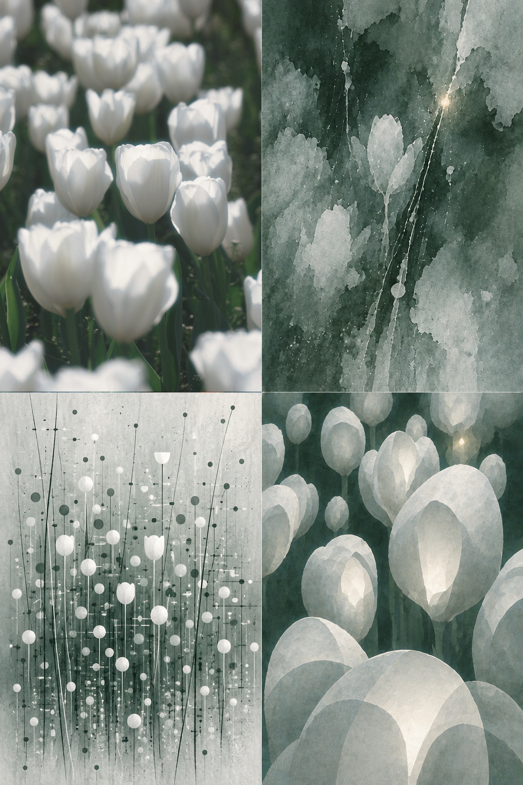

<div align="center">

# ◫ 【S-006】Starryear-2x2

**把一张照片递进为原片、消散记忆、点线谱面与超现实关系场。**


[](./LICENSE.md)


</div>

---

## ⚠️ 声明

> **仅限个人学习、非营利研究与非商业创作。**
> 任何商业使用均须事先取得 Starryear年 的书面许可。
>
> 分享作品时，欢迎标注“使用 Skill：Starryear-2x2”并 **@Starryear年**。

---

## 📖 关于本项目

本 Skill 将一张用户拥有合法权利的照片编排为精确的竖版 2×2 四宫格：左上保留真实原片，右上提炼成湿润消散的记忆，左下转为干性点线谱面，右下则保留原图的关系地图并替换对象身份，形成具有纵深的超现实场域。它固定的是四级变化逻辑，而不是测试照片的题材、色调、形状或构图。生成部分只能使用当前原图的内容关系与色彩系统。

- ✅ 保留原片证据，并让抽象程度逐格增加而画面密度不降低
- ✅ 从原图提取色彩、方向、间隔、重复、层级、张力与 `SOUL STATEMENT`
- ✅ 左下以点线映射真实轨迹和计数组；右下执行“关系保留、对象换壳”
- ✅ 每次换图都重新分析题材、色板、主轴与计数组；左上永远使用当次上传的真实原片
- ✅ 三个生成格共享源图 DNA，但分别保持透明湿性、干性点线与空间体积三种主导语言
- ❌ 不生成四个滤镜、四幅无关作品、三张简化主体或通用装饰水墨

> 📝 The Skill includes the complete prompt in both **Chinese** and **English**.

---

## 🖼️ 示例作品



> 本图仅示范“原片证据 → 消散记忆 → 点线谱面 → 关系保留但对象换壳”的变化逻辑。执行 Skill 时不得参考或复用示例中的题材、白绿色调、数量、形状、空间替身或构图。

---

## 📋 目录

- [使用方法](#-使用方法)
- [可自由调整的部分](#-可自由调整的部分)
- [核心原则](#-核心原则)
- [内容结构](#-内容结构)
- [许可证](#-许可证)

---

## 🚀 使用方法

### 方式一：作为 Codex Skill 使用

1. 将整个 `s-006-starryear-2x2` 文件夹复制到 Codex skills 目录，例如 `~/.codex/skills/`。
2. 开启新的 Codex 对话并上传一张你拥有合法使用权的照片。
3. 提出需求：

   > 使用 `s-006-starryear-2x2` 把这张照片做成竖版抽象四宫格。

4. Skill 只返回一张完成的竖版 2:3 四宫格作品。

### 方式二：作为提示词直接使用

| 语言 | 文件 |
| :---: | :--- |
| 🇨🇳 中文 | [references/s-006-starryear-2x2-prompt.zh-CN.md](references/s-006-starryear-2x2-prompt.zh-CN.md) |
| 🇬🇧 English | [references/s-006-starryear-2x2-prompt.en.md](references/s-006-starryear-2x2-prompt.en.md) |

---

## 🎛️ 可自由调整的部分

| 参数 | 说明 |
| :--- | :--- |
| **输出尺寸** | 推荐 2000×3000；可提高分辨率，但总画布与每格都必须保持竖版 2:3。 |
| **点线密度** | 可随原图重复单元调整，但左下必须由多组不等距节点和至少三条源图轨迹主导。 |
| **空间替身** | 右下可依据当前源图选择体积、折叠、通道、地形或其他关系载体，但不能套用示例形状。 |

---

## 💡 核心原则

1. **原图唯一来源** — 所有主体、关系、色彩、情绪温度与背景偏色都来自用户照片。
2. **抽象递进但不变空** — 写实信息逐格减少，结构尺度、节奏、色域和方向能量逐格增强。
3. **强点线谱面** — 左下格由点与线承担主要信息，轴线、节点、计数组、疏密与地标必须映射原图，不做通用坐标网格。
4. **消除主体剪影** — 左下不能先读成树、花、人、建筑或其他原物；辨识来自关系映射而不是轮廓复刻。
5. **关系保留、对象换壳** — 右下保留位置、层级、计数、方向和压力，但必须替换对象身份；既不重画原物，也不做无来源几何。
6. **主色比例锁定** — 生成格保留原图主色的面积与明度层级，避免被米白纸底或灰洗稀释。
7. **全图无字** — 成品禁止标题、英文、数字、日期、档案号、签名、水印和伪文字。
8. **四格共享 DNA** — 同一主轴、明暗层级、非对称平衡、计数组、节奏与灵魂命题贯穿全部生成格。

---

## 📁 内容结构

```text
s-006-starryear-2x2/
├── README.md
├── LICENSE.md
├── SKILL.md
├── agents/openai.yaml
├── references/
│   ├── s-006-starryear-2x2-prompt.zh-CN.md
│   └── s-006-starryear-2x2-prompt.en.md
└── assets/examples/
```

> ⚠️ `assets/examples/` 仅收录 Starryear年 已确认的最终成品。示例只展示转译方法，不是元素、配色或构图参考。

---

## 📄 许可证

本项目采用 [LICENSE.md](./LICENSE.md) 中规定的使用条款。版权及商务授权联系：[Starryear@outlook.com](mailto:Starryear@outlook.com)。

---

<div align="center">

**如果这个项目对你有帮助，欢迎 Star ⭐ 支持！**

</div>
